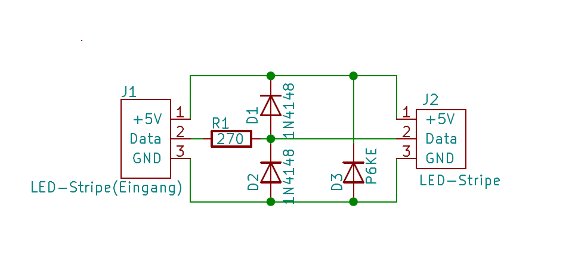
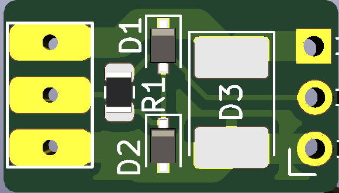
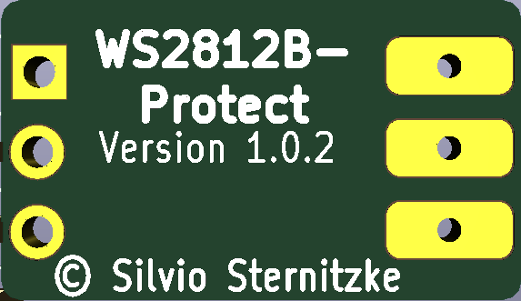

# WS2812B-Protect
Schutzschaltung für WS2812B-Stripes

## Bilder

## Schaltplan

[:arrow_right: Schaltplan](pdf/Schaltplan.pdf)

## Platine

[:arrow_right: PCB Gerber](*.zip)

## Aufbau / Stückliste

### Der Aufbau

### Die benötigten Bauteile
| Bauteil | Link |
| --------|------|
| Bauteilliste Reichelt|[:arrow_right: Reichelt](https://www.reichelt.de/my/1667564)|

## Hinweise

- :exclamation: 
